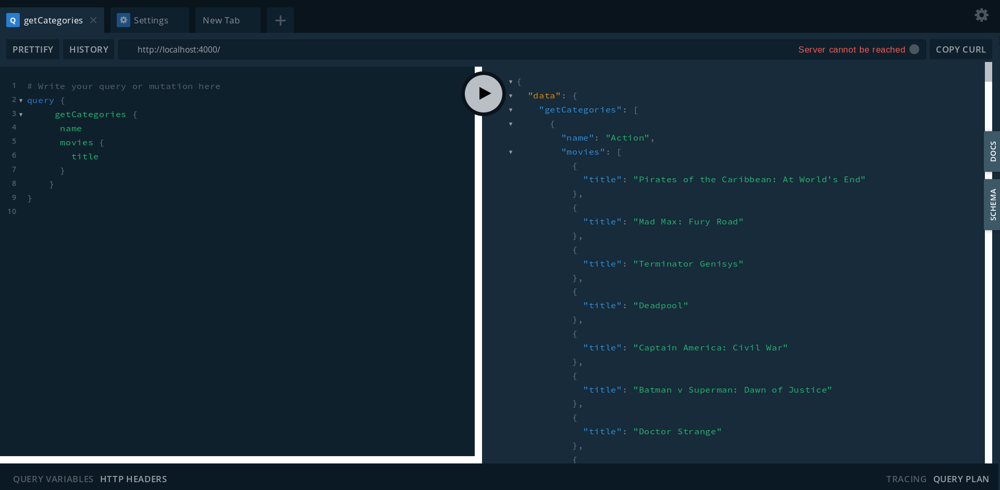

# HackJam Let's play with GraphQL and Apollo

`This session is available in plain JavaScript and TypeScript`

## 1. Your first queries

Go to the GitHub GraphQL API Explorer: https://developer.github.com/v4/explorer/

With the help of the documention that you can toggle on the right upper side of the `GraphiQL` explorer, try to write the following queries:

1. A query to get the following information from the `Hackages` organization:

   - Email
   - Total number of repositories

2. Get the `id` of this repository
3. Try to give a star to this reposiroty. **HINT**: you will need to use a `mutation` and the `id` of the repository (that you should have by now)

## 2. Implement your own API

### Install

```bash
## yarn
yarn
yarn start

## npm
npm install
npm run start
```

Go to [http://localhost:4000/](http://localhost:4000/), you should get a playground where you can type your query/mutation on the left side and see the result on the right side.

If everything is working correctly, you should be able to execute à `hello` query:

```graphql
query helloWorld {
  hello
}
```

### Create your own GraphQL server

Create a `Movie` type within the `gql` string literals:

The `Movie` type contains the following properties:

- `title` of type `String` which is required
- `vote_count` of type `String` which is required
- `id` of type `ID` which is required
- `video` of type `String` which is required
- `vote_average` of type `String` which is required
- `popularity` of type `String` which is required
- `poster_path` of type `String` which is required
- `original_language` of type `String` which is required
- `original_title` of type `String` which is required
- `backdrop_path` of type `String` which is required
- `adult` of type `String` which is required
- `overview` of type `String` which is required
- `release_date` of type `String` which is required

```javascript
const typeDefs = gql`
  type Movie {
      // type definition
  }
`;
```

Now that we defined our `Movie` type, let's try to make a `getMovies` query.

Add a `getMovies` field under the `Query` type that should return an `array` of `Movie`. **HINT**: use the `hello` Query field as example.

```graphql
  type Query {
    getMovies: #return type
  }
```

It's time to implement the `getMovies` resolver now (the function which will be executed when we execute the `getMovies` query).

For now, this function should return an entire list of movies.

```javascript
const resolvers = {
  Query: {
    getMovies(parents, args, ctx, info) {
      // return the movies list
    }
  }
};
```

You can get information about `resolvers` signature here: https://www.apollographql.com/docs/apollo-server/essentials/data#type-signature

You should now by able to run this `getMovies` query within the playground. Try it with different movie `fields` and see how `GraphQL` let you granulary select what information you need!

Let's do the same now for the `categories`:

1. Define the `Category` type
2. Add a `getCategories` field to the `Query` type

The `Category` type has the following properties:

- `id` of type `ID` which is required.
- `name` of type `String` which is required.

3. Implement the corresponding `resolver`
4. Verify that your `getCategories` query works (via the playground)

As you've probably seen by now, a `Movie` is attributed to a list of `Category` through the `category_ids` field of the `Movie` type. Wouldn'it be better to be able to retrieve the list of `category` (and their details) when asking for a `Movie` ?

To make that possible, we should slightly modify our `Movie` type. Add a `categories` field to the `Movie` type. **HINT:**: use the `Category` type we've defined previously.

```graphql
type Movie {
  #Existing fields
  categories: ... #Use the Category type we've defined
}
```

Then, create a `Movie` resolver field (next to the `Query` field) and describe how to resolve the `categories`:

```javascript
const resolvers = {
  Query: {
    //...
  }
  Movie: {
    categories: (parent, args, ctx, info) => {
      // Return the categories
    }
  },
}
```

**HINT**: Only the `categories` from the currently resolved `movie` should be returned. Inspect the `parent` parameter to check if you can grab useful information from there.  
**HINT2**: You can use the `getMoviesForCategory` within the `utils.js` file to help you.

Don't forget to try your solution via the playground! Again, see how we can exactly define which fields we want to get back from the server, and so even for the children.

If you're wondering why we didn't implement the resolvers for the other `Movie` fields, you can read: https://graphql.org/learn/execution/#trivial-resolvers

Let's now do the same but for the other way around: add the possibility to retrieve the list of `movies` from a category:

1. Add a `movies` field to the `Category` type
2. Implement the corresponding `resolver`
3. Test your solution through the playground

Cool! Now let's allow a user to get the `movies` from a specific `category`.

1. Change the `getMovies` Query field to accept an optional `category` string.
2. Adapt the `getMovies` resolver to only return `movies` from the specific `category` **only if the filter is present**. **HINT**: the `category` filter can be accessed through the resolver's `arg` parameter.
3. Test your implementation via the playground.

## 3. Mutation

> ...

## 4. Subscription

> ...

## 5. Playground

